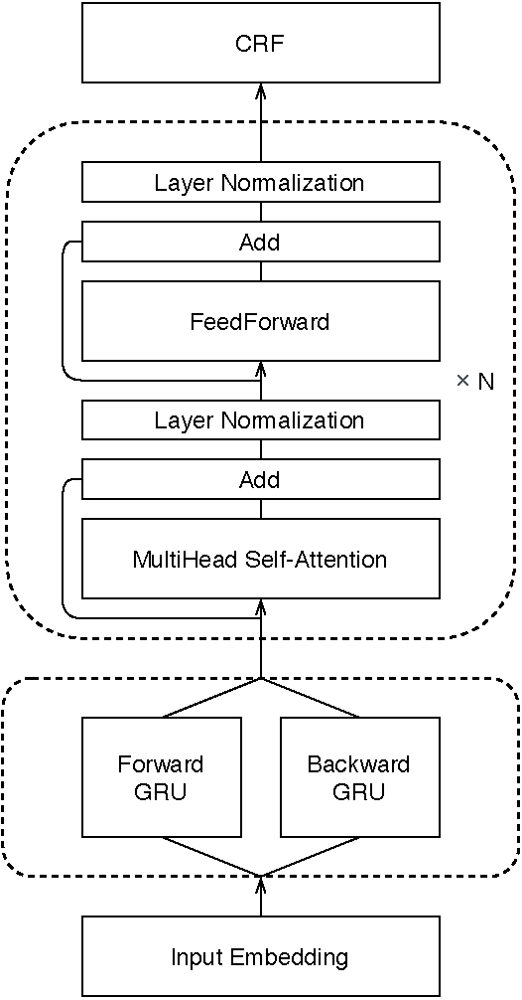
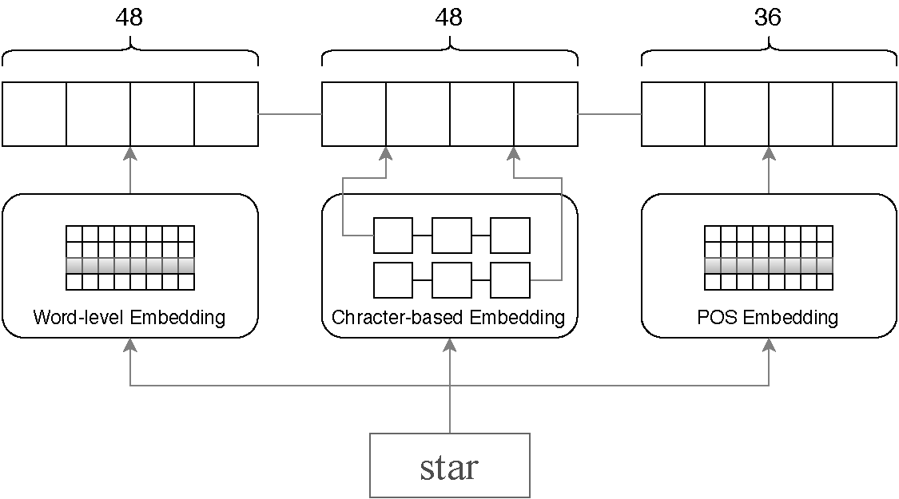
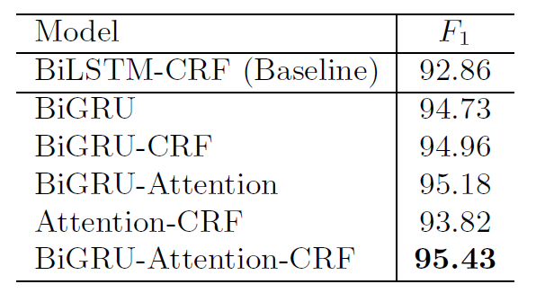
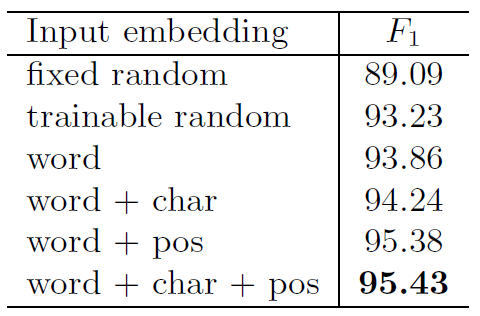
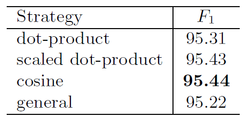

# BiGRU-CRF-with-Attention-for-NER

Train multiple models for named entity recognition (NER) on a toy dataset.

> This project is adapted from an assignment of an NLP course.
> The task aims at comparing the performance of different input embeddings 
> as well as different stacks of layers on NER task.

There are several NER models implemented and trained in this program:

- Attention-CRF
- BiGRU
- BiGRU-Attention
- BiGRU-Attention-CRF
- BiGRU-CRF

<div align="center">
    
</div>

The implementation of the self-attention layer is similar to the one in the Transformer.

Four different ways of computing the attentions are compared:

- Dot-product
- Scaled Dot-product
- Cosine
- General

For feature embeddings, four different combinations are tested, which are compared to each other
and to the fixed / trainable random initialized embeddings.

- Word
- Word + Character
- Word + Character + PoS
- Word + PoS

<div align="center">
    
</div>


## Experimental Results

NER results for different models:



NER results for different input embeddings:



Comparison of different attention strategies:




## Dependencies

Models are run on Python 3.7 in following environment:
```
nltk==3.4.5
numpy==1.18.1
pandas==1.0.3
pytorch==1.5.0
scikit-learn==0.22.1
scipy==1.4.1
tensorboard==2.0.0
torchvision==0.6.0
```


## Files

- data/
    - raw/ : origin data
    - dataset.pkl : processed dataset
    - lookup.pkl : word2index and entity2index lookup tables
    - padded_dataset.pkl : padded dataset
- embed/
    - config.json : path settings for embedding files
    - char_embed.py : generate character embeddings
    - pos_embed.py : generate part-of-speech embeddings
    - word_embed.py : generate word embeddings by Word2Vec Skip-Gram
    - model.py : models for three embeddings mentioned above
- ner/
    - gamma/
        - attention.py : different implementations of attentions
        - data.py : DataLoader & DataProcess
        - model.py : implementations of NER models
        - modules.py : layers that are used in NER models
        - utils : some useful tool functions
    - arguments.py : settings for this program
    - data_processing.py : processes raw data and generates `dataset.pkl`, `lookup.pkl`, `padded_dataset.pkl`
    - test.py : test program to evaluate trained model
    - train.py : model training logic
    - train_attn_crf.py : train model with attention layer and CRF layer
    - train_gru.py : train model with BiGRU layer
    - train_gru_attn.py : train model with BiGRU layer and attention layer
    - train_gru_attn_crf.py : train model with BiGRU, attention and CRF layers
    - train_gru_crf.py : train model with BiGRU layer and CRF layer
- result/
    - ckpt/ : best performed weights for each experiments in the form of state_dict, generate by `torch.save()`
    - embed/ : generated feature embeddings
    - event/ : SummaryWriter file for current training
    

## Usage

**Check ner/arguments.py first** (the default settings should be fine)

### Data Processing

> This part has been done and `dataset.pkl`, `lookup.pkl`, `padded_dataset.pkl` are generated in `data/`
    
```
>>> cd ner
>>> python data_processing.py
```

### Generate Embeddings

> This part has been done and three different input embeddings are placed in `result/embed/` 

```
>>> cd embed
>>> python word_embed.py
>>> python char_embed.py
>>> python pos_embed.py
```

### Train
```
>>> cd ner
>>> python train_gru_attn_crf.py
```
use `python train_*.py` to train specific model

### Test
> This part is not complete, since the toy data does not contain the
> true labels for test set.
```
>>> cd ner
>>> python test.py
```
